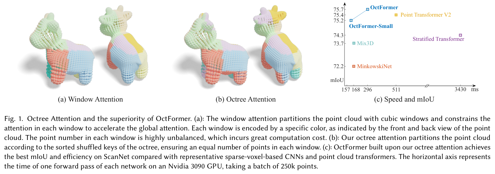

# OctFormer: Octree-based Transformers for 3D Point Clouds

This repository contains the implementation of **OctFormer**. The code is
released under the **MIT license**.

**[OctFormer: Octree-based Transformers for 3D Point Clouds](https://todo)**<br/>
[Peng-Shuai Wang](https://wang-ps.github.io/)<br/>
ACM Transactions on Graphics (SIGGRAPH), 42(4), 2023




- [OctFormer: Octree-based Transformers for 3D Point Clouds](#octformer-octree-based-transformers-for-3d-point-clouds)
  - [1. Installation](#1-installation)
  - [2. ScanNet Segmentation](#2-scannet-segmentation)
  - [3. ScanNet200 Segmentation](#3-scannet200-segmentation)
  - [4. SUN RGB-D Detection](#4-sun-rgb-d-detection)
  - [5. ModelNet40 Classification](#5-modelnet40-classification)


## 1. Installation

The code has been tested on Ubuntu 20.04 with 4 Nvidia 3090 GPUs (24GB memory).


1. Install [Conda](https://www.anaconda.com/) and create a `Conda` environment.
    
    ```bash
    conda create --name octformer python=3.8
    conda activate octformer
    ```

2. Install PyTorch-1.12.1 with conda according to the official documentation.
    
    ```bash
    conda install pytorch==1.12.1 torchvision torchaudio cudatoolkit=11.3 -c pytorch
    ```

3. Clone this repository and install the requirements.
    
    ```bash
    git clone https://github.com/octree-nn/octformer.git
    cd  octformer
    pip install -r requirements.txt
    ```

4. Install the library for octree-based depthwise convolution.
   
   ```bash
   git clone https://github.com/octree-nn/dwconv.git
   pip install ./dwconv
   ```

5. To run the detection experiments, mmdetection is required. Please refer to
   the [official documentation](todo) for installation.

## 2. ScanNet Segmentation

1. **Data**: Download the data from the 
   [ScanNet benchmark](https://kaldir.vc.in.tum.de/scannet_benchmark/). 
   Unzip the data and place it to the folder <scannet_folder>. Run the following
   command to prepare the dataset.

    ```bash
    python tools/seg_scannet.py --run process_scannet --path_in <scannet_folder>
    ```

2. **Train**: Run the following command to train the network with 4 GPUs and
   port 10001. The mIoU on the validation set without voting is 74.6, the
   training log and weights can be downloaded
   [here](https://1drv.ms/u/s!Ago-xIr0OR2-gRrV35QGxnHJR4ku?e=ZXRqV7).

    ```bash
    python scripts/run_seg_scannet.py --gpu 0,1,2,3 --alias scannet --port 10001
    ```

3. **Evaluate**: Run the following command to get the per-point predictions for
   the validation dataset with a voting strategy. And after voting, the mIoU is
   75.7 on the validation dataset.

    ```bash
    python scripts/run_seg_scannet.py --gpu 0 --alias scannet --run validate
    ```


## 3. ScanNet200 Segmentation


## 4. SUN RGB-D Detection


## 5. ModelNet40 Classification

1. **Data**: Run the following command to prepare the dataset.

    ```bash
    python tools/cls_modelnet.py
    ```

2. **Train**: Run the following command to train the network with 1 GPU. The
   classification accuracy on the testing set without voting is 92.7%. And the
   training log and weights can be downloaded 
   [here](https://1drv.ms/u/s!Ago-xIr0OR2-gRskk20x7V_Mc9FI?e=jVAf8o).
    ```bash
    python classification.py --config configs/cls_m40.yaml SOLVER.gpu 0,
    ```
